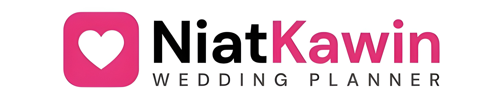

# 🎮 Brilliano Dhiya Ulhaq (Kanrishaurus)
### Technical Project Lead & Senior Frontend Developer

---

 

  

---

## 🔮 Active Quest: Project NiatKawin

  
  
    
  
  **Status:** 🚀 In Production & Active Development  
  **Platform:** Android (Google Play Store)  
  **Class:** Premium Wedding Templates & Invitation Simulator
  
   

  

---

## 🕹️ Playable Retro Arcade Games (Built in Portfolio)

I built an interactive retro arcade cabinet directly into my website! You can play six classic arcade games written from scratch:

| Game | Vibe / Mechanics | Play link |
| :--- | :--- | :--- |
| 🧱 **Tetris** | Classic block-falling and line-clearing puzzle. | [**Play Now 🎮**](https://brilli.is-a.dev/arcade/tetris) |
| 🐍 **Snake** | Nostalgic retro snake game with adjustable speeds. | [**Play Now 🎮**](https://brilli.is-a.dev/arcade/snake) |
| 🧩 **Sudoku** | Grid-based puzzle with adjustable difficulties. | [**Play Now 🎮**](https://brilli.is-a.dev/arcade/sudoku) |
| 🫧 **Bubble Blast** | Aiming and matching bubble launcher. | [**Play Now 🎮**](https://brilli.is-a.dev/arcade/bubble) |
| 🍬 **Candy Match** | Standard Match-3 tile swapping and score tracker. | [**Play Now 🎮**](https://brilli.is-a.dev/arcade/match3) |
| 🚀 **Arcade Shooter** | Fast-paced retro space invader firing game. | [**Play Now 🎮**](https://brilli.is-a.dev/arcade/shooter) |

---

## ⚡ Skill Tree (Abilities Unlocked: 58/63)

### 🛡️ Core Spells & Languages

### ⚔️ Frontend Arts

### 🔮 Backend Magic

### 🎒 Tools & Runes

---

## 📊 Live Game Stats (GitHub & GitLab Contributions)

---

## 👨‍👩‍👧‍👦 Guild (Family)

  

---

## 📬 Contact & Guild Invites

 

