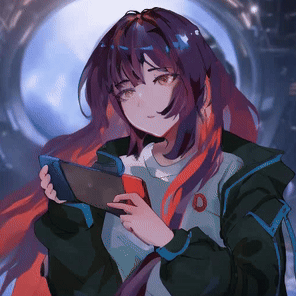

<div align="center">

# 🎮 Brilliano Dhiya Ulhaq (Brilli)
### Senior Frontend Developer & Technical Project Lead


---

```text
 ___________________________________________________________
| [🎮 CHARACTER STATUS]                                     |
|                                                           |
|  NAME: Brilliano Dhiya Ulhaq (Brilli)                     |
|  CLASS: Senior Frontend Developer & Technical Lead        |
|  LEVEL: Lvl 6+ (Years of Exp)                             |
|  HP:    [██████████████████████████████] 99/99            |
|  MP:    [████████████████████████████░] 95/95             |
|                                                           |
|  ATK (Core Weapons): Next.js, React, TypeScript           |
|  DEF (Security): Row Level Security (RLS), Keycloak SSO   |
|  SPD (Performance): Core Web Vitals (-74% load time)      |
|  AGI (SEO Growth): +45% Organic Traffic Increase          |
|___________________________________________________________|
```

<br>

<p align="center">
  <a href="https://brillidhiya.vercel.app/"></a>
</p>

</div>

---

## 🌟 Professional Quest Log (Experience)

### ⚔️ Active Quest: IT Project Manager & Freelance Tech Lead
**Kyoto, Japan (Remote) | 80&Company** | *Nov 2025 – Feb 2026*
- Led full-stack development of AI-powered SNS platform with **Supabase & Row Level Security (RLS)** for enterprise-grade protection.
- Designed secure authentication system supporting OAuth 2.0 (Google, Facebook) and custom email flows.
- Translated CEO and executive team product vision into technical roadmaps, delivering 3 major feature releases on schedule.
- Engineered and tested AI bot personas using prompt engineering to maintain consistent conversation quality.

### 🛡️ Completed Quest: Senior Frontend Developer
**Tangerang, Indonesia | PT. IoT Kreasi Indonesia** | *Jan 2021 – Present*
- Standardized Next.js & React stack across the IoT division (adopted by 6 developers).
- Architected flagship IoT monitoring platform managing **10,000+ active connected devices** with real-time dashboards and automated logging.
- Built enterprise ticketing and automated billing modules, digitizing complete service lifecycles.
- Raised organic traffic by **45%** by building automated RSS feeds, robots.txt, and sitemap.js generation.
- Reduced average page load time from **4.2s to 1.1s** (-74%) via ISR and modern image formats (AVIF/WebP).
- Integrated **Keycloak SSO** with microservices architecture for unified authentication.

### 🔮 Completed Quest: Frontend Developer (Freelance)
**Kyoto, Japan (Remote) | 80&Company** | *Jul 2024 – Jul 2025*
- Developed job search platform using Next.js and TypeScript, implementing secure and seamless user authentication flows.
- Optimized high-traffic Shopify e-commerce templates for **KOSE MUWMAZE**, raising Core Web Vitals by **35%**.

### ⚡ Completed Quest: Technical Lead & Frontend Developer (Freelance)
**Jakarta, Indonesia (Remote) | Kisah Kreatif** | *Feb 2023 – Mar 2024*
- Delivered logistics website for **PT. Pupuk Indonesia Logistik**, handling 500+ daily shipment tracking requests.
- Architected a secure Learning Management System (LMS) with forced fullscreen anti-cheating, stopping 99% of exam violations.
- Led 3-person development team through full project lifecycle from requirements gathering to production.

---

## 🕹️ Playable Retro Arcade Games (Built in Portfolio)

I built an interactive retro arcade cabinet directly into my website! You can play six classic arcade games written from scratch:

<div align="center">

| Game | Vibe / Mechanics | Play link |
| :--- | :--- | :--- |
| 🧱 **Tetris** | Classic block-falling and line-clearing puzzle. | [**Play Now 🎮**](https://brillidhiya.vercel.app/) |
| 🐍 **Snake** | Nostalgic retro snake game with adjustable speeds. | [**Play Now 🎮**](https://brillidhiya.vercel.app/) |
| 🧩 **Sudoku** | Grid-based puzzle with adjustable difficulties. | [**Play Now 🎮**](https://brillidhiya.vercel.app/) |
| 🫧 **Bubble Blast** | Aiming and matching bubble launcher. | [**Play Now 🎮**](https://brillidhiya.vercel.app/) |
| 🍬 **Candy Match** | Standard Match-3 tile swapping and score tracker. | [**Play Now 🎮**](https://brillidhiya.vercel.app/) |
| 🚀 **Arcade Shooter** | Fast-paced retro space invader firing game. | [**Play Now 🎮**](https://brillidhiya.vercel.app/) |

</div>

---

## 🛠️ RPG Skill Tree (Tech Stack)

### 🗡️ Frontend Weapons


### 🛡️ Backend & Database Armor


### 🔮 Magic Spells & Emerging Tech


### 🎒 Utility Inventory


---

## 📊 Live Game Stats (GitHub Contributions)

<div align="center">

<table border="0">
  <tr>
    <td align="center">
      
    </td>
    <td align="center">
      
    </td>
  </tr>
</table>

<br>


</div>

---

## 👨‍👩‍👧‍👦 Guild (Family)

<div align="center">
  
</div>

---

<div align="center">

## 📬 Contact & Guild Invites

<a href="https://www.youtube.com/@kanrishaurus" target="_blank"></a>
<a href="https://www.instagram.com/brilliano_d/" target="_blank"></a>
<a href="https://discord.gg/MM8KDg2X" target="_blank"></a>
<a href="mailto:brillidhiya@gmail.com"></a>
<a href="https://www.linkedin.com/in/brilliano-dhiya-ulhaq-44b196194/" target="_blank"></a>
<a href="https://wa.me/6285155436866" target="_blank"></a>
<a href="https://linktr.ee/brillidhiya" target="_blank"></a>

<br>



</div>
